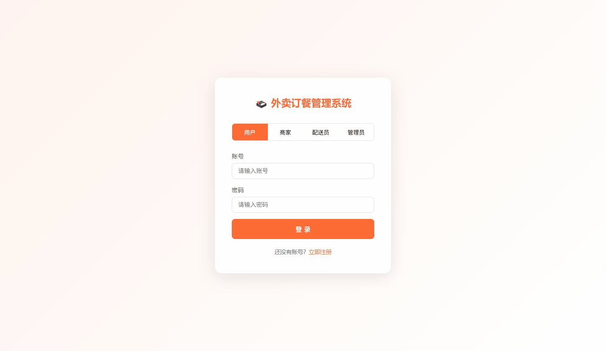
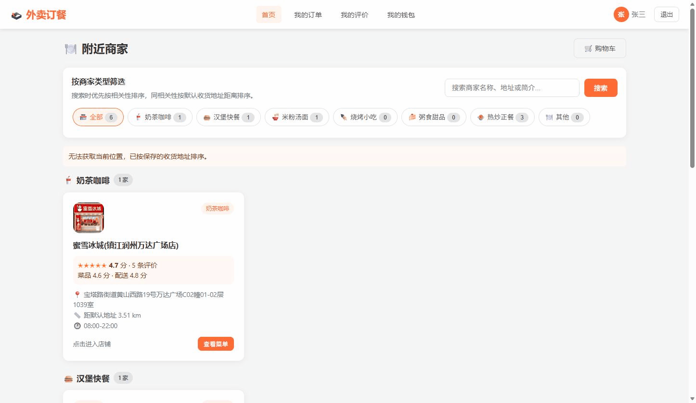
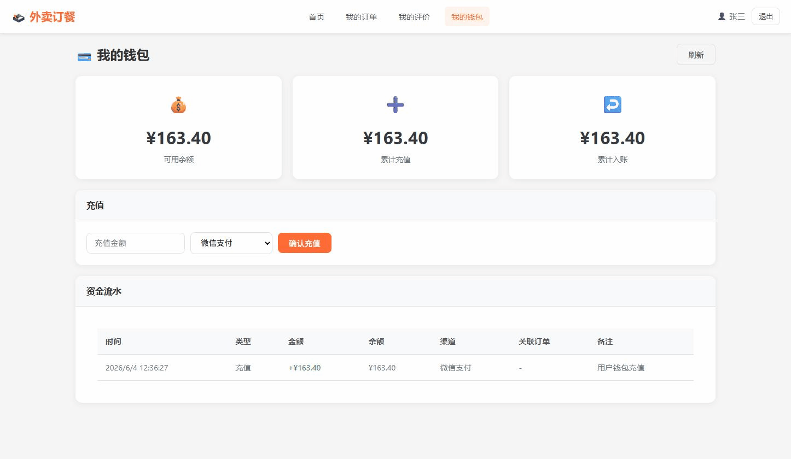
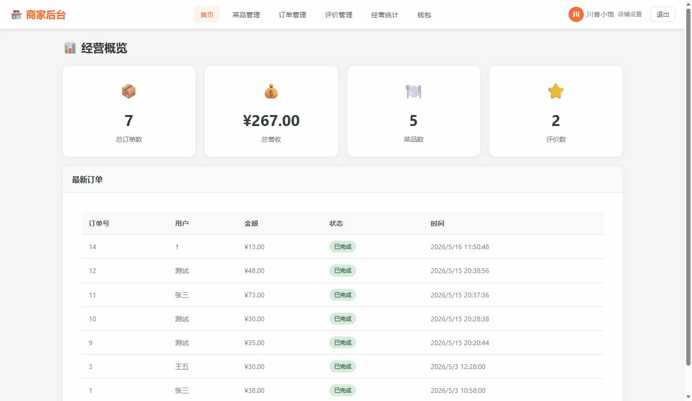
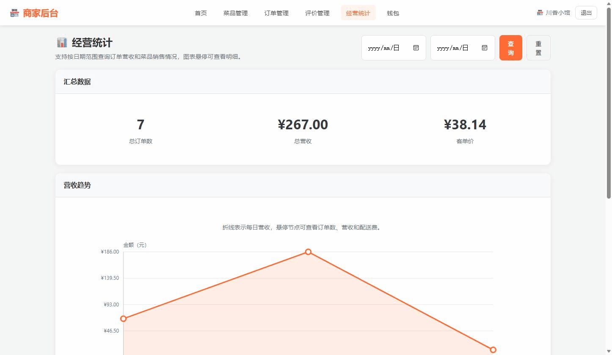
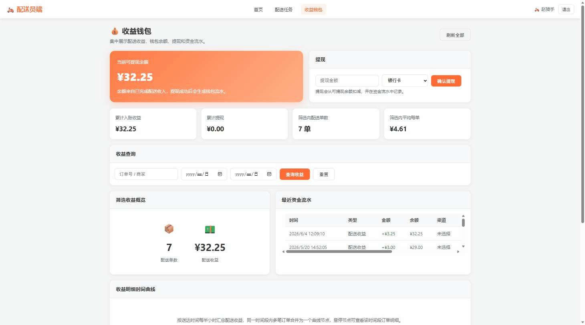
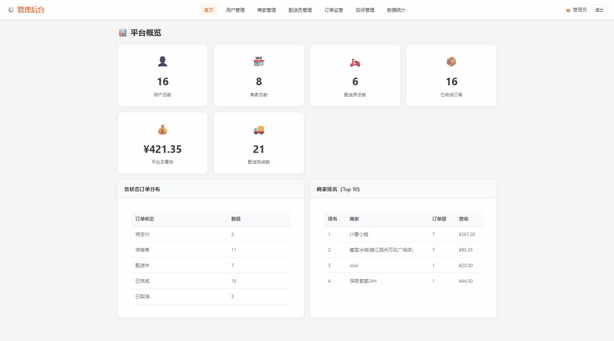

# 外卖订餐管理系统

[](#)
[](#)
[](#)
[](LICENSE)

一个覆盖 **用户下单、商家接单、骑手配送、平台管理** 的外卖订餐课程设计项目，基于 Flask + MySQL + 原生前端实现完整业务闭环。

**在线演示**：[https://takewaydesign.top/](https://takewaydesign.top/)  
**GitHub 仓库**：[xiaomizhaMt/takeaway-ordering-system](https://github.com/xiaomizhaMt/takeaway-ordering-system)

## 项目亮点

- **四端角色完整**：用户端、商家端、配送员端、管理员端均有独立页面和后端接口。
- **钱包资金闭环**：覆盖充值、支付、退款、商家结算、骑手收益、提现和流水记录。
- **订单状态完整**：支持支付、接单、备餐、配送、完成、取消、异常、售后等状态流转。
- **并发安全处理**：库存扣减、商家接单、骑手抢单等关键操作使用事务、行锁或条件更新保护。
- **地图地址能力**：接入高德地图地址搜索、选点、距离计算、配送费估算和超距离限制。
- **公开仓库友好**：真实密码和 API Key 通过环境变量或本地私密配置文件管理，避免提交到 Git。

## 界面预览

以下 GIF 来自已部署的在线演示站点，展示系统主要角色和核心页面。

| 登录页 | 用户首页 |
|---|---|
|  |  |

| 用户钱包 | 商家工作台 |
|---|---|
|  |  |

| 商家统计 | 骑手收益 |
|---|---|
|  |  |

| 管理员概览 |
|---|
|  |

---

## 1. 项目简介

本项目是一个基于 **Python Flask + MySQL + 原生 HTML/CSS/JavaScript** 的外卖订餐管理系统，围绕：

```text
用户下单点餐 → 用户支付 → 商家接单备餐 → 配送员接单配送 → 用户确认收货/评价 → 平台监管/售后处理
```

这一完整业务链路展开。

系统包含四类角色：

| 角色 | 主要职责 |
|------|----------|
| 用户 | 浏览商家和菜品、加入购物车、下单、支付、钱包充值/支付、查看订单、确认收货、评价/投诉、售后申请 |
| 商家 | 店铺信息维护、菜品管理、上货/上架、订单接单、备餐、出餐、回复评价、经营统计、钱包入账/提现 |
| 配送员 | 查看可接订单、抢单、取餐、配送、送达、上报配送异常、查看收益钱包、提现 |
| 管理员 | 用户/商家/配送员管理、商家/骑手审核、订单流监管、投诉审核、退款/部分退款、平台统计 |

数据库按课程设计要求采用 **收敛版核心表结构**，购物车使用前端或 Session 临时维护，支付信息、售后状态、退款状态并入订单主表；钱包余额保存在用户、商家、配送员主表，资金变化统一记录到钱包流水表，保证充值、支付、退款、结算、提现闭环可追踪。

---

## 2. 技术栈

| 层次 | 技术 |
|------|------|
| 后端 | Python 3 + Flask |
| 数据库 | MySQL 8.0+ |
| 数据库驱动 | PyMySQL |
| 跨域 | flask-cors |
| 前端 | HTML5 + CSS3 + 原生 JavaScript |
| 认证 | Token + Flask Session 兼容 |
| 启动入口 | `run.py` |
| 数据库初始化/迁移 | `init_db.py` |

---

## 3. 项目结构

```text
├── run.py                         # Flask 启动入口
├── init_db.py                     # 数据库安全迁移/重置脚本
├── requirements.txt               # Python 依赖
├── docs/images/                   # README 演示截图
├── backend/
│   ├── app.py                     # Flask 应用工厂，注册蓝图
│   ├── config.py                  # 数据库与应用配置，读取环境变量或本地覆盖文件
│   ├── config_local.example.py    # 本地/服务器私密配置示例，复制后填写真实密码
│   ├── db/
│   │   └── db_helper.py           # 数据库连接与事务辅助
│   ├── routes/
│   │   ├── auth_routes.py         # 登录、注册、注销
│   │   ├── user_routes.py         # 用户端接口
│   │   ├── merchant_routes.py     # 商家端接口
│   │   ├── rider_routes.py        # 配送员端接口
│   │   └── admin_routes.py        # 管理员端接口
│   ├── services/
│   │   ├── token_service.py       # Token 服务
│   │   ├── wallet_service.py      # 钱包余额、流水、充值、扣款、退款、结算、提现
│   │   └── order_safety_service.py# 订单售后、退款、兼容旧库字段补齐
│   └── utils/
│       ├── auth_helper.py         # 登录鉴权辅助
│       └── response.py            # 统一响应格式
├── frontend/
│   ├── index.html                 # 登录页
│   ├── register.html              # 注册页
│   ├── css/style.css              # 全局样式
│   ├── js/api.js                  # API 封装
│   ├── js/map-config.js           # 高德地图 Key 与安全密钥配置
│   ├── js/map-picker.js           # 地址搜索、定位、地图选点公共组件
│   └── pages/
│       ├── user/                  # 用户端页面
│       ├── merchant/              # 商家端页面
│       ├── rider/                 # 配送员端页面
│       └── admin/                 # 管理员端页面
└── database/
    ├── 01_create_database.sql     # 建库建表、外键、索引
    └── 03_insert_sample_data.sql  # 示例数据
```

---

## 4. 数据库设计核心

数据库名称：

```text
takeaway_ordering_system
```

核心表：

| 表名 | 说明 |
|------|------|
| `User` | 用户账号、登录密码、支付密码、默认收货信息、账号状态、钱包余额 |
| `Merchant` | 商家账号、店铺信息、营业时间、营业状态、审核状态、钱包余额 |
| `Rider` | 配送员账号、手机号、身份证号、工作状态、审核状态、钱包余额 |
| `Dish` | 菜品信息、分类、图片、价格、规格、库存、预警库存、上架状态、销量 |
| `Order_Info` | 订单主信息、支付信息、订单状态、售后状态、退款信息、关键时间 |
| `Order_Item` | 订单明细，记录菜品、数量、下单单价、小计 |
| `Delivery` | 配送履约信息，记录骑手、配送状态、取餐/送达时间、异常说明、收益 |
| `Review` | 用户评价/投诉、评分、内容、商家回复、投诉审核信息 |
| `Wallet_Transaction` | 钱包流水，记录角色、流水类型、金额、变动后余额、关联订单/配送、支付渠道、备注和时间 |

### 4.1 地址与定位字段

系统已接入高德地图选点。地图只用于注册、店铺设置、用户默认地址和下单时选择地址；订单排序、配送费计算不实时请求高德 API，而是使用数据库中保存的经纬度。

| 表名 | 字段 | 说明 |
|------|------|------|
| `User` | `default_latitude`, `default_longitude`, `default_location_name` | 用户默认收货地址经纬度和地点名 |
| `Merchant` | `shop_latitude`, `shop_longitude`, `shop_location_name`, `merchant_type`, `shop_image_url` | 商家地址经纬度、地点名、商家类型和店铺图片 |
| `Order_Info` | `receiver_latitude`, `receiver_longitude`, `merchant_latitude`, `merchant_longitude` | 下单时的收货地址和商家地址经纬度快照 |

旧数据库没有这些字段时，执行 `python init_db.py` 会自动补列，不需要重建数据库。

### 4.2 配送费规则

配送费按商家地址到用户收货地址的直线距离计算：

| 距离 | 配送费 |
|------|--------|
| 3km 以内 | 3 元 |
| 超过 3km | 3 元 + 超出公里数 × 0.5 元 |

如果历史数据或手动地址缺少经纬度，系统使用默认配送费 3 元，保证手动地址仍可下单。

配送距离限制：

- 商家到收货地址超过 100km 时，用户端禁止加入购物车，并且后端下单接口会再次拦截；
- 购物车中每个商家独立计算商品小计、配送费和距离；
- 多商家购物车可以一次提交支付，系统会按商家拆成多张订单。

### 4.3 订单状态

| 值 | 状态 |
|----|------|
| 0 | 待支付 |
| 1 | 待接单 |
| 2 | 备餐中 |
| 3 | 已出餐 |
| 4 | 配送中 |
| 5 | 已完成 |
| 6 | 已取消 |
| 7 | 异常 |

### 4.4 支付状态

| 值 | 状态 |
|----|------|
| 0 | 未支付 |
| 1 | 支付成功 |
| 2 | 支付失败 |
| 3 | 已退款 |

### 4.5 售后与退款字段

`Order_Info` 中补充了售后和退款相关字段：

| 字段 | 说明 |
|------|------|
| `after_sale_status` | 售后状态：0 无，1 申请中，2 已处理 |
| `after_sale_apply_time` | 售后申请时间 |
| `after_sale_reason` | 售后申请原因 |
| `after_sale_result` | 售后/监管处理结果 |
| `after_sale_handle_time` | 售后处理时间 |
| `refund_amount` | 实际退款金额 |
| `refund_type` | 退款类型：0 无，1 全额退款，2 部分退款 50% |
| `refund_reason` | 退款原因 |
| `refund_time` | 退款时间 |

`Review` 中补充了投诉审核字段：

| 字段 | 说明 |
|------|------|
| `complaint_status` | 投诉审核状态：0 无，1 待审核，2 通过，3 驳回 |
| `complaint_refund_type` | 投诉退款结论：0 无，1 全额，2 部分 50% |
| `complaint_handle_note` | 管理员审核备注 |
| `complaint_handle_time` | 管理员审核时间 |

后端会在访问相关接口时自动兼容旧数据库，缺少字段时自动补齐。

### 4.6 钱包字段与流水

`User`、`Merchant`、`Rider` 均包含：

| 字段 | 说明 |
|------|------|
| `wallet_balance` | 钱包余额，默认 `0.00` |

`Wallet_Transaction` 用于统一记录三端资金流水：

| 字段 | 说明 |
|------|------|
| `owner_type` | 钱包所属角色：`user`、`merchant`、`rider` |
| `owner_id` | 对应角色 ID |
| `transaction_type` | 流水类型：充值、支付、退款、收入、提现等 |
| `amount` | 本次变动金额 |
| `balance_after` | 变动后的余额 |
| `related_order_id` | 关联订单 ID，可为空 |
| `related_delivery_id` | 关联配送 ID，可为空 |
| `pay_channel` | 充值或支付渠道 |
| `remark` | 流水备注 |
| `create_time` | 流水创建时间 |

---

## 5. 快速开始

### 5.1 环境要求

- Python 3.8+
- MySQL 8.0+
- Windows / Linux / macOS

### 5.2 配置数据库连接

项目中的 `backend/config.py` 会正常提交到 GitHub，但不会写死真实数据库密码或 Flask 密钥。配置读取顺序如下：

1. 优先读取系统环境变量；
2. 如果存在 `backend/config_local.py`，再用它覆盖环境变量或默认值；
3. 如果两者都没有配置，则使用 `backend/config.py` 中的默认开发值。

`backend/config_local.py` 已经被 `.gitignore` 忽略，适合保存本机或服务器真实密码，不会被上传到 GitHub。

推荐方式一：使用环境变量。

Windows PowerShell 示例：

```powershell
$env:DB_HOST="localhost"
$env:DB_PORT="3306"
$env:DB_USER="root"
$env:DB_PASSWORD="你的MySQL密码"
$env:DB_NAME="takeaway_ordering_system"
$env:APP_SECRET_KEY="请换成一串随机密钥"
$env:APP_HOST="127.0.0.1"
$env:APP_PORT="5000"
```

Linux / macOS 示例：

```bash
export DB_HOST=localhost
export DB_PORT=3306
export DB_USER=root
export DB_PASSWORD='你的MySQL密码'
export DB_NAME=takeaway_ordering_system
export APP_SECRET_KEY='请换成一串随机密钥'
export APP_HOST=127.0.0.1
export APP_PORT=5000
```

推荐方式二：使用本地覆盖文件。

复制示例文件：

```powershell
Copy-Item backend/config_local.example.py backend/config_local.py
```

然后修改 `backend/config_local.py`：

```python
class DatabaseConfig:
    HOST = 'localhost'
    PORT = 3306
    USER = 'root'
    PASSWORD = '你的MySQL密码'
    DATABASE = 'takeaway_ordering_system'
    CHARSET = 'utf8mb4'


class AppConfig:
    SECRET_KEY = '请换成一串随机密钥'
    DEBUG = True
    HOST = '127.0.0.1'
    PORT = 5000
```

`backend/config.py` 保持为可提交版本：

```python
class DatabaseConfig:
    HOST = os.getenv('DB_HOST', 'localhost')
    PORT = int(os.getenv('DB_PORT', '3306'))
    USER = os.getenv('DB_USER', 'root')
    PASSWORD = os.getenv('DB_PASSWORD', '')
    DATABASE = os.getenv('DB_NAME', 'takeaway_ordering_system')
    CHARSET = os.getenv('DB_CHARSET', 'utf8mb4')
```

请确保 MySQL 用户名、密码、数据库名与本机或服务器一致。如果没有配置 `DB_PASSWORD`，系统会用空密码连接 MySQL，通常会导致数据库连接失败。

### 5.3 配置高德地图

地图配置文件：

```text
frontend/js/map-config.js
```


```javascript
window.MAP_CONFIG = window.MAP_CONFIG || {
  amapKey: 'your_amap_js_api_key',
  securityJsCode: 'your_amap_security_js_code'
};
```

这个 Key 必须在高德控制台创建为“Web端(JS API)”类型，并配置安全密钥。普通“Web服务”Key 不能加载 JS 地图组件。

当前仓库中的 `frontend/js/map-config.js` 默认使用空占位符，避免把真实 Key 上传到 GitHub。未配置或加载失败时，页面会退回纯文本地址输入，不影响注册、保存店铺信息或下单。服务器部署时如果需要地图选点功能，需要在服务器代码或部署流程中填入真实的 `amapKey` 和 `securityJsCode`。

### 5.4 安装依赖

在项目根目录执行：

```bash
pip install -r requirements.txt
```

如果使用项目内虚拟环境，Windows PowerShell 示例：

```powershell
.\takeaway\Scripts\activate
pip install -r requirements.txt
```

### 5.5 初始化或更新数据库

推荐执行：

```bash
python init_db.py
```

默认模式是安全迁移：

- 数据库不存在时会创建数据库；
- 已有数据库不会被删除；
- 已有业务数据不会被清空；
- 会补齐钱包相关字段、钱包流水表和必要索引。

如果服务器已经部署过旧版本，拉取代码后在项目根目录执行下面命令即可更新数据库结构：

```bash
python init_db.py
```

只有在明确需要清空并重建演示库时，才使用重置模式：

```bash
python init_db.py --reset
```

`--reset` 会删除并重建 `takeaway_ordering_system`，原有数据会丢失，生产或已有数据环境不要使用。

也可以手动执行 SQL：

```bash
mysql -u root -p < database/01_create_database.sql
mysql -u root -p takeaway_ordering_system < database/03_insert_sample_data.sql
```

手动执行 `01_create_database.sql` 和 `03_insert_sample_data.sql` 更适合全新演示库初始化；已有数据的服务器优先使用 `python init_db.py` 做兼容迁移。

### 5.6 启动项目

```bash
python run.py
```

浏览器访问：

```text
http://127.0.0.1:5000
```

登录页为：

```text
http://127.0.0.1:5000/index.html
```

注册页为：

```text
http://127.0.0.1:5000/register.html
```

### 5.7 GitHub 仓库与远程地址

当前 GitHub 仓库：

```text
https://github.com/xiaomizhaMt/takeaway-ordering-system
```

本地仓库保留了 Gitee 远程 `origin`，并新增 GitHub 远程 `github`：

```bash
git remote -v
```

预期输出包含：

```text
origin  https://gitee.com/xiaomizhaMt/database-course-design.git
github  https://github.com/xiaomizhaMt/takeaway-ordering-system.git
```

首次上传到 GitHub 时使用的是干净首提交，只上传清理后的当前项目文件，不携带旧 Gitee 历史，避免历史提交里的 token、登录缓存或 API Key 被同步到 GitHub。

后续如果继续在当前 GitHub 分支开发，提交并推送：

```bash
git add .
git commit -m "your commit message"
git push github codex/github-clean-upload:master
```

如果要回到原 Gitee 历史分支：

```bash
git switch master
```

如果要继续更新 Gitee：

```bash
git push origin master
```

如果要继续更新 GitHub：

```bash
git switch codex/github-clean-upload
git push github codex/github-clean-upload:master
```

注意：`token.json`、`login.json`、`.env`、`backend/config_local.py`、日志和缓存目录都不会上传；真实密码、真实地图 Key、服务器密钥只应放在环境变量或本地覆盖文件中。

---

## 6. 测试账号与正常登录复现

### 6.1 默认测试账号

| 角色 | 账号 | 密码 | 说明 |
|------|------|------|------|
| 管理员 | `admin` | `admin123` | 平台后台管理员 |
| 用户 | `zhangsan` | `123456` | 示例用户，支付密码也是 `123456` |
| 用户 | `lisi` | `123456` | 示例用户，支付密码也是 `123456` |
| 用户 | `wangwu` | `123456` | 示例用户，支付密码也是 `123456` |
| 商家 | `merchant001` | `123456` | 示例商家，已审核通过 |
| 商家 | `merchant002` | `123456` | 示例商家，已审核通过 |
| 商家 | `merchant003` | `123456` | 24 小时营业示例商家，已审核通过 |
| 配送员 | `rider001` | `123456` | 示例配送员，在线，已审核通过 |
| 配送员 | `rider002` | `123456` | 示例配送员，忙碌，已审核通过 |

说明：

- 管理员无需注册，直接使用 `admin / admin123` 登录。
- 示例商家和配送员已经审核通过，可以直接登录。
- 新注册商家或配送员需要管理员审核通过后才能登录。
- 用户支付订单时需要输入支付密码，示例用户支付密码均为 `123456`。

### 6.2 登录步骤

1. 启动后打开：

```text
http://127.0.0.1:5000
```

2. 在登录页选择角色：

```text
用户 / 商家 / 配送员 / 管理员
```

3. 输入对应账号和密码。
4. 登录成功后系统会自动跳转到对应角色首页。

如果登录失败，请优先检查：

- 是否执行过 `python init_db.py` 完成初始化或兼容迁移；
- `backend/config.py` 中数据库密码是否正确；
- 商家/配送员是否已经被管理员审核通过；
- 浏览器是否缓存旧页面，可按 `Ctrl + F5` 强制刷新。

---

## 7. 推荐演示流程

以下流程适合课程验收时按顺序复现。

### 7.1 管理员登录与审核

1. 使用管理员账号登录：

```text
admin / admin123
```

2. 进入管理后台，可查看：
   - 用户管理；
   - 商家管理；
   - 配送员管理；
   - 订单监管；
   - 投诉处理；
   - 平台统计。

3. 如果现场注册了新商家或新配送员，需要管理员在后台审核通过后，对方才能登录。

### 7.2 用户正常下单与支付

1. 使用用户账号登录：

```text
zhangsan / 123456
```

2. 首页选择一个营业商家，例如：

```text
merchant003 对应的 24H 商家
```

3. 浏览菜品并加入购物车。
4. 在购物车中填写或一键使用默认收货地址。
5. 提交订单。
6. 在“我的订单”中点击支付。
7. 选择支付方式，例如：

```text
我的钱包 / 微信支付 / 支付宝 / 银行卡 / 货到付款
```

如果选择“我的钱包”，需要先进入“我的钱包”页面充值，充值方式为模拟微信、支付宝或银行卡入账。

8. 输入支付密码：

```text
123456
```

9. 支付成功后订单状态从“待支付”变为“待接单”。

### 7.3 商家接单、备餐、出餐

1. 使用商家账号登录：

```text
merchant001 / 123456
```

2. 进入订单管理页。
3. 找到用户刚支付的订单。
4. 点击接单，订单进入“备餐中”。
5. 点击出餐，订单进入“已出餐”或“配送中”。

并发控制说明：商家接单使用条件更新，只有订单仍处于“已支付且待接单”时才会成功，避免重复接单或状态覆盖。

### 7.4 配送员抢单、取餐、送达

1. 使用配送员账号登录：

```text
rider001 / 123456
```

2. 确认配送员状态为在线。
3. 查看可接订单，可选择按发布时间或当前位置到商家距离排序。
4. 点击接单。骑手最多同时接取 3 个未完成订单；商家到收货地址超过 50km 的订单不能接取，超过 100km 的订单不会出现在可接单列表。
5. 商家出餐后，配送员点击取餐。
6. 配送完成后点击送达。
7. 订单变为已完成，配送员收益写入骑手钱包，商家结算金额写入商家钱包。

并发控制说明：配送员抢单使用事务和行锁，防止多个配送员同时抢到同一订单，并限制同一骑手最多同时持有 3 个未完成配送任务。

### 7.5 用户确认收货与评价

1. 用户重新进入“我的订单”。
2. 查看订单状态时间线。
3. 对已送达订单确认收货。
4. 提交普通评价或投诉评价。

### 7.6 配送异常强制退款演示

适合演示“配送员提示配送异常后，由平台强制退款”。

1. 用户下单并支付。
2. 商家接单并出餐。
3. 配送员接单。
4. 配送员在任务中点击“上报异常”。
5. 后端会自动：
   - 将配送记录标记为异常；
   - 将订单状态标记为异常；
   - 平台执行强制全额退款；
   - 写入退款金额、退款原因、退款时间；
   - 退款金额退回用户“我的钱包”。

### 7.7 售后投诉与管理员退款/部分退款演示

适合演示“订单完成后售后评价问题，投诉经管理员审核无误可退款或部分退款 50%”。

1. 用户完成订单后提交投诉评价，或调用售后申请：

```http
POST /api/user/orders/<order_id>/after-sale
```

2. 管理员进入投诉处理页面，查看待审核投诉。
3. 管理员根据实际情况选择：
   - 驳回；
   - 全额退款；
   - 部分退款 50%。

通过退款审核后，退款金额统一退回用户“我的钱包”，后端会防止同一订单重复退款。

对应接口：

```http
PUT /api/admin/complaints/<review_id>/handle
```

请求示例：

```json
{
  "action": "full_refund",
  "note": "投诉属实，全额退款"
}
```

```json
{
  "action": "partial_refund",
  "note": "问题部分属实，退款50%"
}
```

```json
{
  "action": "reject",
  "note": "证据不足，驳回"
}
```

---

## 8. 重点功能说明

### 8.1 用户端

- 商家浏览与搜索。
- 首页只展示审核通过且当前正在营业的商家，支持按商家类型筛选。
- 商家搜索默认先按名称、地址、简介等文本相关度排序，再在相关度相同或接近时按用户默认地址距离排序。
- 用户登录进入首页后只自动获取一次当前位置；若当前位置与已保存收货地址差距较大，会提示继续使用旧地址或更新收货地址。
- 搜索商家不会反复触发定位；未修改地址时继续按已保存收货地址排序，修改收货地址后首页会刷新并按新地址排序。
- 个人信息页可维护姓名、电话、默认收货人、默认收货电话、默认收货地址和地址经纬度。
- 菜品按分类展示。
- 购物车下单。
- 购物车只展示已加入购物车的商品，可直接增减已选商品数量。
- 购物车支持不同商家的商品一起支付，提交时按商家拆分订单；骑手接单也以拆分后的单个商家订单为单位。
- 购物车下单区域可使用默认地址或地图选点。
- 配送费按商家到收货地址距离计算，3km 内 3 元，超出部分每公里 0.5 元。
- 商家距离收货地址超过 100km 时，禁止加入购物车和下单。
- 餐具份数选择。
- 支付方式选择和支付密码校验。
- 订单列表、订单详情、订单状态时间线。
- 取消未接单订单。
- 确认收货。
- 普通评价、投诉评价、售后申请。
- 我的钱包：余额查询、模拟充值、钱包流水、钱包支付、退款入账。

### 8.2 商家端

- 店铺信息维护。
- 店铺地址支持手动输入和高德地图选点，保存地址经纬度。
- 商家类型使用固定分类，便于用户端按类型筛选。
- 支持上传店铺图片；未上传时用户端按商家类型显示默认图标。
- 菜品新增、修改、删除。
- 菜品图片上传。
- 菜品上货、库存预警、上架/下架。
- 订单接单、拒单、出餐。
- 评价查看和回复。
- 经营统计：订单趋势、营收汇总、菜品销量排行。
- 钱包：订单完成后结算入账、余额和流水查询、模拟提现。

### 8.3 配送员端

- 工作状态切换。
- 查看可接订单，默认按发布时间排序。
- 获取当前位置后，可按骑手当前位置到商家地址的距离排序，并显示距离。
- 可接单列表隐藏配送距离超过 100km 的订单，配送距离超过 50km 的订单后端拒绝接单。
- 每名骑手最多同时接取 3 个未完成订单。
- 并发安全抢单。
- 取餐、配送、送达；送达不限制当前位置，只校验任务归属和配送状态。
- 配送异常上报。
- 收益钱包：合并展示配送收益、钱包余额、提现和资金流水。
- 收益曲线按送达时间每 30 分钟汇总一次，同一时间段内多笔订单先求和后显示为一个曲线节点。

### 8.4 管理员端

- 用户启用/禁用。
- 商家审核、删除。
- 配送员审核、删除。
- 全平台订单查询与详情查看。
- 订单流监督：异常订单、待处理售后、待接单积压、待配送积压。
- 投诉审核：驳回、全额退款、50% 部分退款。
- 手动强制退款。
- 平台统计：用户数、商家数、配送员数、订单数、交易额、配送量。

---

## 9. 核心接口摘要

### 9.1 认证接口

```http
POST /api/auth/login
POST /api/auth/register
POST /api/auth/logout
GET  /api/auth/current_user
POST /api/auth/token_login
```

### 9.2 用户端接口

```http
GET    /api/user/profile
PUT    /api/user/profile
GET    /api/user/merchants
GET    /api/user/dishes
GET    /api/user/cart
POST   /api/user/cart/items
POST   /api/user/cart/checkout
GET    /api/user/orders
POST   /api/user/orders
GET    /api/user/orders/<order_id>
PUT    /api/user/orders/<order_id>/pay
PUT    /api/user/orders/pay-batch
PUT    /api/user/orders/<order_id>/cancel
PUT    /api/user/orders/<order_id>/confirm
GET    /api/user/orders/<order_id>/status
POST   /api/user/orders/<order_id>/after-sale
GET    /api/user/merchants/<merchant_id>/reviews
GET    /api/user/dishes/<dish_id>/reviews
GET    /api/user/wallet
POST   /api/user/wallet/recharge
GET    /api/user/reviews
POST   /api/user/reviews
PUT    /api/user/reviews/<review_id>
DELETE /api/user/reviews/<review_id>
```

`GET /api/user/merchants` 支持参数：

| 参数 | 说明 |
|------|------|
| `keyword` | 商家名称、地址、简介、类型关键字 |
| `type` | 商家类型筛选 |
| `lat`, `lng` | 用户默认地址或当前位置经纬度，用于相关度相同后的距离排序 |

### 9.3 商家端接口

```http
GET    /api/merchant/shop
PUT    /api/merchant/shop
GET    /api/merchant/categories
GET    /api/merchant/dishes
POST   /api/merchant/dishes
PUT    /api/merchant/dishes/<dish_id>
PUT    /api/merchant/dishes/<dish_id>/stock-in
PUT    /api/merchant/dishes/<dish_id>/shelf
POST   /api/merchant/dishes/<dish_id>/image
DELETE /api/merchant/dishes/<dish_id>
GET    /api/merchant/orders
PUT    /api/merchant/orders/<order_id>/accept
PUT    /api/merchant/orders/<order_id>/reject
PUT    /api/merchant/orders/<order_id>/ready
GET    /api/merchant/reviews
PUT    /api/merchant/reviews/<review_id>/reply
GET    /api/merchant/statistics/orders
GET    /api/merchant/statistics/dishes
GET    /api/merchant/wallet
POST   /api/merchant/wallet/withdraw
```

### 9.4 配送员端接口

```http
GET  /api/rider/profile
PUT  /api/rider/profile
PUT  /api/rider/status
GET  /api/rider/tasks
GET  /api/rider/tasks/available
POST /api/rider/tasks/accept
PUT  /api/rider/tasks/<delivery_id>/pickup
PUT  /api/rider/tasks/<delivery_id>/deliver
PUT  /api/rider/tasks/<delivery_id>/exception
GET  /api/rider/income
GET  /api/rider/wallet
POST /api/rider/wallet/withdraw
```

`GET /api/rider/tasks/available` 支持参数：

| 参数 | 说明 |
|------|------|
| `sort=time` | 默认按发布时间排序 |
| `sort=distance` | 按骑手当前位置到商家地址距离排序 |
| `lat`, `lng` | 骑手当前位置，经纬度缺失时自动退回时间排序 |

配送员接单限制：

- 可接单列表不显示商家到收货地址超过 100km 的订单。
- 骑手最多同时持有 3 个未完成配送任务。
- 接单时校验商家到收货地址配送距离，超过 50km 的订单不可接取。
- 送达操作不做位置限制，只校验该配送任务属于当前骑手且状态可送达。

### 9.5 管理员端接口

```http
GET    /api/admin/users
PUT    /api/admin/users/<user_id>/status
DELETE /api/admin/users/<user_id>
GET    /api/admin/merchants
PUT    /api/admin/merchants/<merchant_id>/audit
DELETE /api/admin/merchants/<merchant_id>
GET    /api/admin/riders
PUT    /api/admin/riders/<rider_id>/audit
DELETE /api/admin/riders/<rider_id>
GET    /api/admin/orders
GET    /api/admin/orders/<order_id>
GET    /api/admin/orders/supervision
PUT    /api/admin/orders/<order_id>/force-refund
GET    /api/admin/complaints
PUT    /api/admin/complaints/<review_id>/handle
GET    /api/admin/statistics/overview
GET    /api/admin/statistics/trends
GET    /api/admin/statistics/merchant-ranking
```

---

## 10. 本次重点完善内容

### 10.1 用户下单并发控制

- 下单流程在同一数据库事务中完成。
- 购物车支持一次提交多个商家分组，每个商家分组生成一张订单，批量支付接口会一次校验支付密码并完成多订单支付。
- 菜品库存使用 `SELECT ... FOR UPDATE` 行锁。
- 同一订单中重复菜品会先合并数量再校验库存。
- 库存扣减、销量增加、订单主表、订单明细同时提交或回滚。
- 商家到收货地址超过 100km 时，前端禁止加入购物车，后端创建订单时再次校验并拒绝下单。

### 10.2 配送员接单并发控制

- 抢单时锁定配送员和订单。
- 防止多个骑手抢到同一订单。
- 防止同一骑手超过 3 个未完成配送任务。
- 接单时校验配送距离，超过 50km 不可接取；超过 100km 的订单不展示在可接单列表。
- 条件更新失败时提示刷新订单状态。

### 10.3 商家上货

- 支持补货接口 `stock-in`。
- 支持上架/下架接口 `shelf`。
- 库存为 0 时禁止上架。

### 10.4 管理员订单流监管

- 支持查看异常订单、售后申请、待接单积压、待配送积压。
- 支持管理员手动强制退款。

### 10.5 售后处理

- 配送员上报配送异常后，平台自动强制全额退款。
- 用户完成订单后可发起售后申请或投诉评价。
- 投诉进入管理员审核队列。
- 管理员可根据人工判断结果：
  - 驳回；
  - 全额退款；
  - 50% 部分退款。
- 后端防止重复审核和重复退款。

### 10.6 三端钱包闭环

- 用户可在“我的钱包”中通过微信、支付宝、银行卡模拟充值。
- 订单支付支持 `wallet` 钱包支付，继续校验用户支付密码。
- 钱包余额不足、支付密码错误时支付失败且余额不变。
- 取消已支付订单、管理员强制退款、投诉退款、配送异常退款统一退回用户钱包。
- 商家在订单完成后按订单金额扣除配送费结算入账。
- 骑手在送达后按配送收益入账。
- 商家和骑手支持模拟提现，提现会扣减余额并记录流水。
- 商家收入、骑手收入和用户退款都做幂等检查，避免重复点击造成重复入账或重复退款。
- 骑手端“收益管理”和“钱包”合并为一个“收益钱包”页面，导航只保留一个入口。
- 骑手收益曲线按每半小时汇总配送收益，同一时间段内多笔订单先合并金额再绘制。

### 10.7 地图选点与地址降级

- 公共组件 `frontend/js/map-picker.js` 封装高德 JS API。
- 商家注册、商家店铺设置、用户个人信息、购物车下单都可复用地图选点。
- 支持搜索地点、点击地图选点、浏览器定位后展示附近兴趣点。
- 搜索地点结果先按关键词相关性排序，再结合当前定位或地图选点距离排序，减少出现距离过远但无关地点靠前的情况。
- 点击地图后，右侧兴趣点列表按距离当前选点排序。
- 高德 Key 为空、SDK 加载失败、浏览器拒绝定位时，地址输入仍可手动填写。

### 10.8 营业商家与商家类型

- 用户首页只显示 `business_status = 1`、`audit_status = 1`，并且当前时间落在营业时段内的商家。
- 商家类型固定为：奶茶咖啡、汉堡快餐、米粉汤面、烧烤小吃、粥食甜品、热炒正餐、其他。
- 商家注册和店铺设置都会校验商家类型，避免保存无效类型。
- 旧库缺少 `merchant_type` 时会自动补列，并按示例商家和菜品信息做一次回填。

### 10.9 多账号多页面登录

- 前端 Token 使用 `sessionStorage` 按角色隔离保存，不再使用同一个全局登录态覆盖所有页面。
- 同一个浏览器中同时打开用户、商家、骑手、管理员页面时，角色之间不会互相覆盖。
- 如果要同时登录多个同角色账号，建议使用不同浏览器窗口或无痕窗口；浏览器从已有标签页复制新标签时可能复制同一份 `sessionStorage`。

---

## 11. 初始化后检查点

执行：

```bash
python init_db.py
python run.py
```

如果是已有数据的服务器，`python init_db.py` 会做兼容迁移，不会清空原数据；不要使用 `python init_db.py --reset`。

打开：

```text
http://101.133.162.252:5000
```

建议依次检查：

1. 管理员 `admin / admin123` 能登录。
2. 用户 `zhangsan / 123456` 能登录并看到商家。
3. 用户首页只显示审核通过且当前营业时间内的商家。
4. 用户可在“个人信息”中修改默认地址，地图选点后会保存经纬度。
5. 商家 `merchant001 / 123456` 能登录并看到订单/菜品。
6. 商家可在店铺设置中修改商家类型和地图地址。
7. 配送员 `rider001 / 123456` 能登录并查看任务。
8. 用户下单后可支付，支付密码为 `123456`。
9. 用户可进入“我的钱包”充值，支付时可选择“我的钱包”。
10. 购物车只显示已选商品，可增减数量；不同商家的商品可一起支付并按商家拆单。
11. 购物车配送费按商家地址到收货地址距离计算，上方商家小计和底部合计应一致。
12. 商家距离收货地址超过 100km 时，不能加入购物车，也不能下单。
13. 商家可接单、出餐。
14. 配送员可接单、取餐、送达或上报异常，并可按当前位置距离排序可接订单。
15. 骑手最多同时接取 3 单；超过 50km 的订单不可接取，超过 100km 的订单不会出现在可接单列表。
16. 订单完成后商家钱包、骑手钱包会生成对应收入流水。
17. 骑手“收益钱包”中收益曲线按每半小时汇总显示。
18. 用户可确认收货、评价、投诉。
19. 管理员可查看投诉并执行退款/部分退款/驳回，退款回到用户钱包。

---

## 12. 常见问题

### 12.1 登录失败

优先检查：

- 是否执行过 `python init_db.py` 完成初始化或兼容迁移；
- MySQL 服务是否启动；
- `backend/config.py` 中 MySQL 用户名和密码是否正确；
- 商家/配送员是否已由管理员审核通过；
- 浏览器缓存是否导致页面未更新，可按 `Ctrl + F5`。

### 12.2 依赖安装失败

确认在项目根目录执行：

```bash
pip install -r requirements.txt
```

如果使用虚拟环境，先激活虚拟环境。

### 12.3 数据库更新会不会清空数据

默认执行 `python init_db.py` 不会清空已有数据，只会创建缺失的数据库对象并补齐钱包相关字段、流水表和索引。

只有执行下面命令才会清空并重建数据库：

```bash
python init_db.py --reset
```

已有用户、订单、商家、骑手等数据的服务器不要运行 `--reset`。

### 12.4 修改代码后页面无变化

建议：

1. 终端按 `Ctrl + C` 停止服务；
2. 重新执行 `python run.py`；
3. 浏览器按 `Ctrl + F5` 强制刷新。

### 12.5 高德地图无法搜索或定位

优先检查：

- `frontend/js/map-config.js` 中 `amapKey` 是否为“Web端(JS API)”类型；
- `securityJsCode` 是否填写了高德控制台对应的安全密钥；
- 高德控制台域名白名单是否允许当前访问域名，例如 `127.0.0.1`、`localhost` 或服务器域名；
- 浏览器是否允许当前位置权限；
- 修改 Key 后是否强制刷新页面。

当前项目只在地址选择时调用高德 API，骑手订单距离排序和配送费计算使用数据库保存的经纬度。

### 12.6 多个页面登录后账号互相覆盖

当前前端按角色把 Token 存在 `sessionStorage`。正常打开不同角色页面不会互相覆盖；如果是同一角色多个账号，建议使用不同浏览器窗口、无痕窗口，或先退出再登录。不要从已登录标签页直接复制标签作为另一个同角色账号的登录入口。

### 12.7 PowerShell profile 警告

如果终端出现类似：

```text
profile.ps1 cannot be loaded because running scripts is disabled
```

这是 PowerShell 执行策略警告，不影响 Flask 项目运行和 Git 操作。

---

## 13. 注意事项

1. 当前系统使用 Flask 开发服务器，适合课程设计和本地演示，不建议直接用于生产环境。
2. 支付为课程设计中的模拟支付，不接入真实第三方支付。
3. 支付密码只用于用户支付校验，示例用户支付密码均为 `123456`。
4. 购物车使用前端/Session 临时维护，不单独建购物车表。
5. 支付状态和支付方式保存在订单表中，钱包充值、钱包支付、退款、收入、提现记录保存在 `Wallet_Transaction`。
6. 售后和投诉审核由管理员人工判断，系统负责记录审核结果并把退款退回用户钱包。
